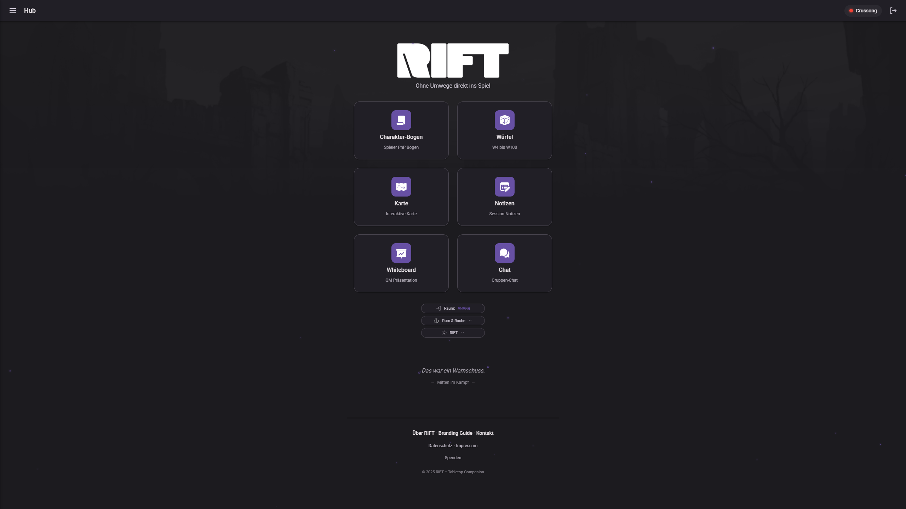
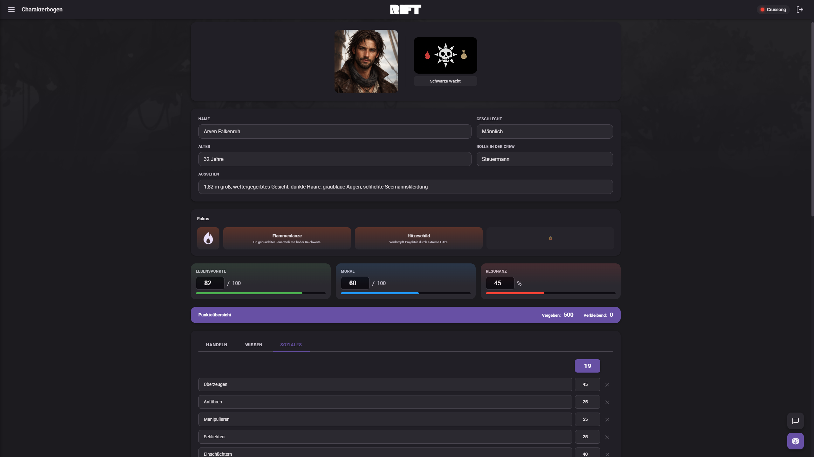
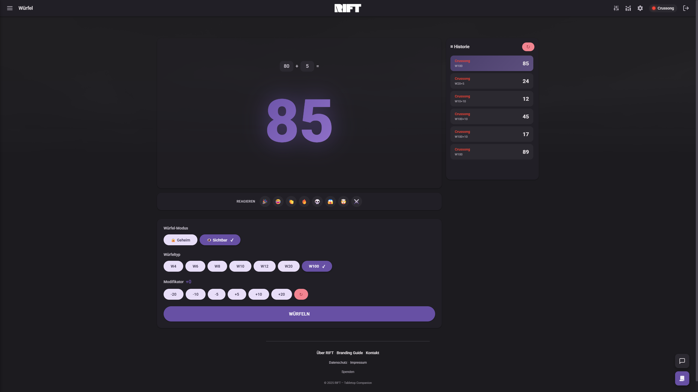
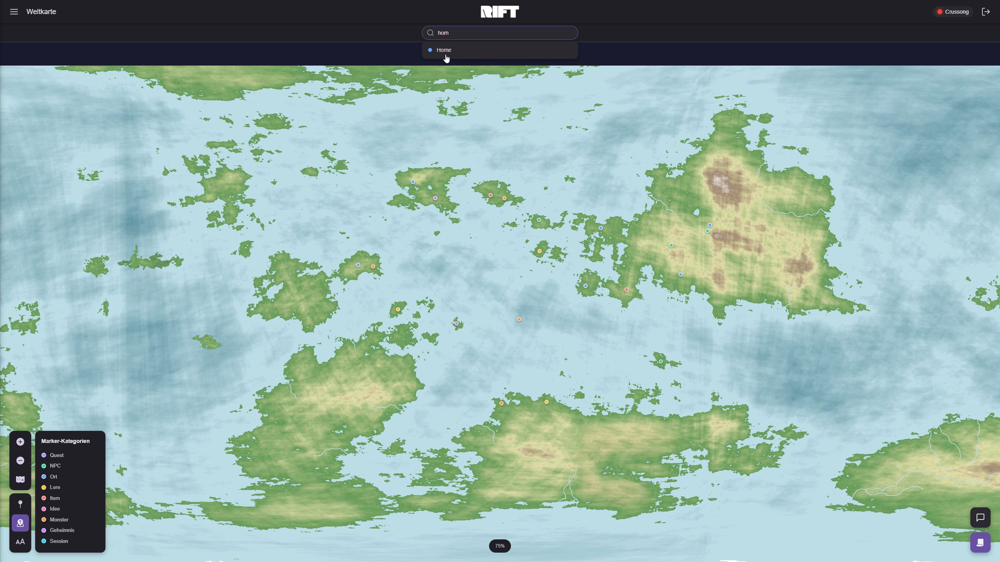
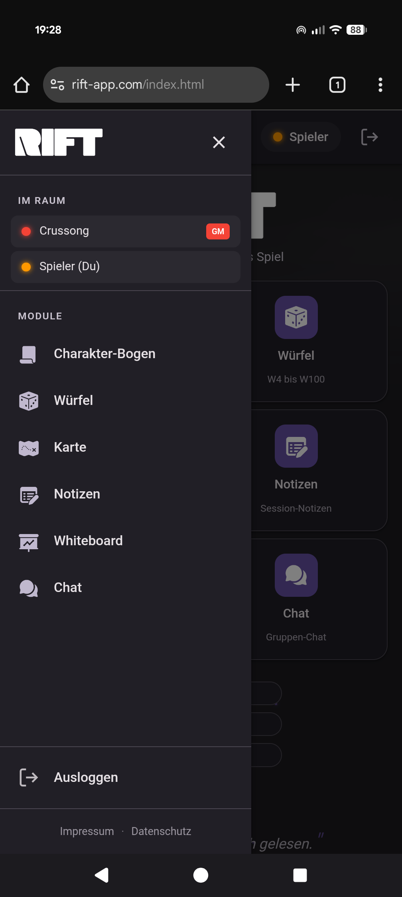
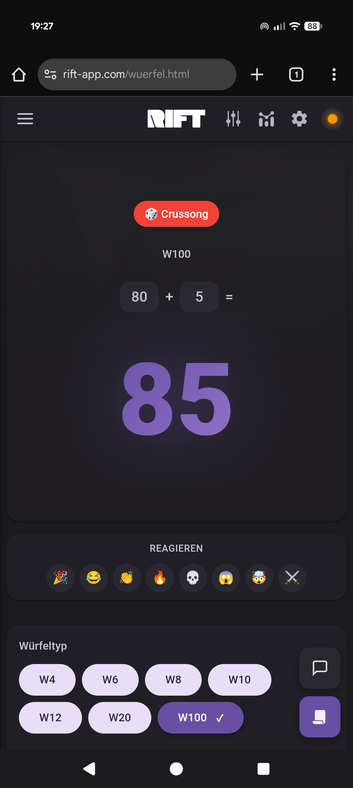
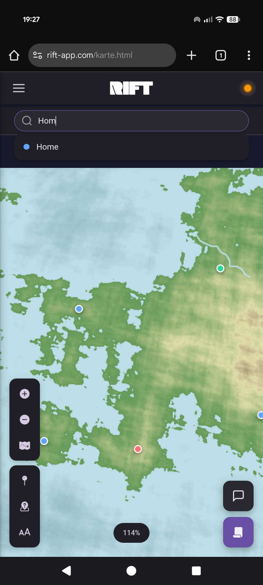
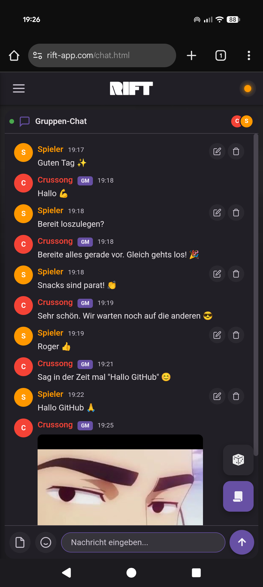

<p align="center">
  
</p>

<h1 align="center">RIFT – Tabletop Companion</h1>

<p align="center">
  <strong>Skip the setup. Start playing.</strong><br>
  A lightning-fast, browser-based companion for tabletop RPG sessions.
</p>

<p align="center">
  <a href="https://rift-app.com">
    
  </a>
</p>

<p align="center">
  
  
  
  
</p>

---

## ⚡ Why RIFT?

**Because your session shouldn't wait for your tools.**

Most tabletop apps want you to sign up, configure settings, watch tutorials, and sync accounts before you even roll your first die. RIFT takes a different approach:

> **Open → Create Room → Play.** That's it.

No accounts. No installations. No friction. Just you, your party, and the adventure.

---

## 🚀 Features

| Module | Description |
|--------|-------------|
| 🎭 **Character Sheets** | Quick-access character management designed for play, not paperwork |
| 🎲 **Dice Roller** | Instant rolls from D4 to D100 – with satisfying animations and critical hit effects |
| 💬 **Live Chat** | Real-time group chat with image sharing, reactions, and file uploads |
| 🗺️ **Interactive Map** | Share and explore maps together with zoom, pan, and markers |
| 📝 **Notes** | Capture session moments, plot hooks, and ideas on the fly |
| 🎨 **Whiteboard** | Collaborative drawing space for sketches, tactics, and spontaneous creativity |

### ✨ Highlights

- **Instant Room Creation** – Generate a 5-digit code and share it. Done.
- **Real-time Sync** – Everyone sees dice rolls, chat messages, and whiteboard changes live
- **GM Tools** – Player management, session timer, module controls, and session logs
- **Works Everywhere** – Desktop, tablet, mobile. No app install needed.
- **Offline Capable** – Service Worker caching for blazing fast load times
- **PWA Ready** – Add to homescreen for an app-like experience

---

## 🎮 Getting Started

```
1. Go to rift-app.com
2. Create a room (you're the GM) or join with a code
3. Pick a name and color
4. Play!
```

That's not a simplified version. That's actually all there is to it.

---

## 📸 Screenshots

### Desktop
<p>
  
  
</p>
<p>
  
  
</p>

### Mobile
<p>
  
  
  
  
</p>

---

## 🎯 Design Philosophy

RIFT is built on three pillars:

### 1. Speed First
Every interaction is optimized for minimal clicks and instant feedback. Hover-prefetching, service worker caching, and lightweight code ensure the app feels native-fast.

### 2. Zero Friction
No sign-ups, no tutorials, no configuration wizards. If a feature needs explanation, it's redesigned until it doesn't.

### 3. Focused Simplicity
Each module does one thing well. No feature bloat, no hidden menus, no "pro tiers". Everything is available to everyone, immediately.

---

## 🛠️ Technical Stack

RIFT runs entirely in the browser with no build step required:

- **Frontend:** Vanilla HTML, CSS, JavaScript
- **Real-time Sync:** Firebase Realtime Database
- **Hosting:** Netlify (with automatic pretty URLs)
- **Domain & DNS:** Cloudflare
- **PWA:** Service Worker + Web App Manifest

No React. No Vue. No webpack. Just fast, maintainable code that works.

---

## 🌍 Language

RIFT is currently available in **German only**. The entire UI, all text, and documentation within the app are in German. International language support may be considered in the future.

---

## 📋 Roadmap

- [x] Core modules (Character, Dice, Chat, Map, Notes, Whiteboard)
- [x] Real-time multiplayer sync
- [x] GM tools and session management
- [x] PWA support
- [x] Pretty URLs
- [ ] Multiple rulesets/systems support
- [ ] Export/Import session data
- [ ] English language option

---

## 🤝 Built With

<p>
  
  
  
  
</p>

---

## 📜 License

This project is under active development. License details coming soon.

---

<p align="center">
  <strong>Ready to roll?</strong><br><br>
  <a href="https://rift-app.com">
    
  </a>
</p>

<p align="center">
  <sub>Made with 🎲 for tabletop enthusiasts</sub>
</p>
